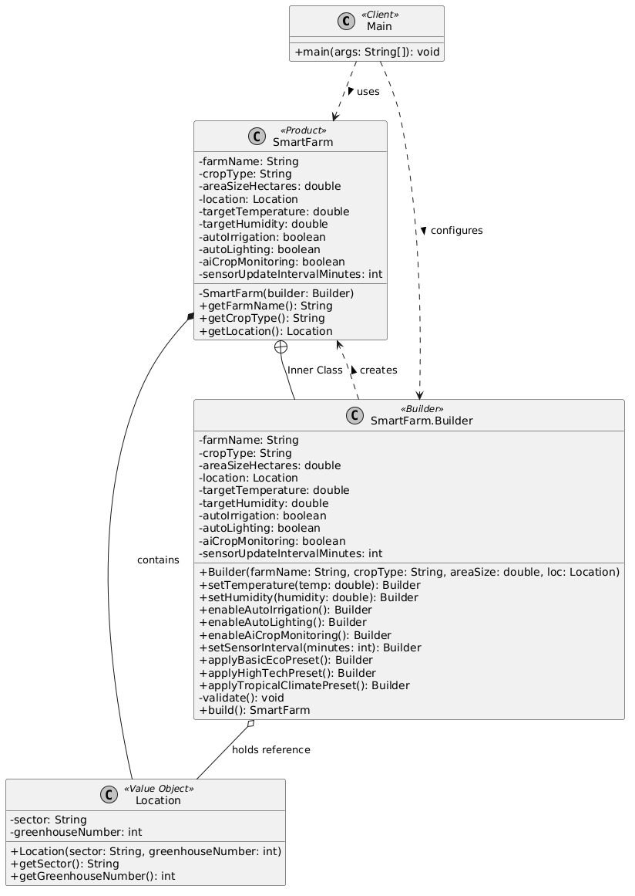

# Assignment 1 Report: Builder Pattern Implementation

**Course:** Software Design Patterns  
**Topic:** Builder Pattern: Design Under Changing Requirements  
**Domain:** Smart Farm System  
**Programming Language:** Java

---

## 1. Problem Description & Individual Variant

### Domain Overview
The selected domain for this project is a **Smart Farm System**. Modern automated greenhouses and smart farms rely on complex environment controls, automated subsystems, and IoT sensor arrays. Creating a `SmartFarm` instance requires configuring various physical, environmental, and automated parameters.

### Variant Specification
* **Domain:** Smart Farm System
* **Required Properties (4):**
  1. `farmName` (*String*) — Name/identifier of the smart farm.
  2. `cropType` (*String*) — Primary crop cultivated.
  3. `areaSizeHectares` (*double*) — Farm physical area in hectares.
  4. `location` (*Location*) — Value object representing sector and greenhouse ID.
* **Optional Properties (6):**
  1. `targetTemperature` (*double*) — Target ambient temperature in °C.
  2. `targetHumidity` (*double*) — Target relative humidity percentage.
  3. `autoIrrigation` (*boolean*) — Flag for automated watering systems.
  4. `autoLighting` (*boolean*) — Flag for automated spectrum lighting.
  5. `aiCropMonitoring` (*boolean*) — AI computer vision analysis for crop health.
  6. `sensorUpdateIntervalMinutes` (*int*) — Telemetry reporting interval in minutes.
* **Individual Constraints (Cross-Field Rules):**
  * **Constraint 1:** If AI Crop Monitoring is enabled (`aiCropMonitoring = true`), the sensor update interval must not exceed 15 minutes to supply sufficient data.
  * **Constraint 2:** Tropical/High-humidity configurations (`targetHumidity > 80.0%`) strictly require automated irrigation (`autoIrrigation = true`) to maintain moisture balance.

---

## 2. Part A - Initial Constructor-Based Solution & Design Problems

### Initial Constructor Implementation
Before implementing the Builder pattern, the `SmartFarm` class relied on a conventional multi-parameter (telescoping) constructor:

```java
// Anti-pattern: Overloaded telescoping constructor
public SmartFarm(String farmName, String cropType, double areaSizeHectares, Location location,
                 double targetTemperature, double targetHumidity, boolean autoIrrigation,
                 boolean autoLighting, boolean aiCropMonitoring, int sensorUpdateIntervalMinutes) {
    this.farmName = farmName;
    this.cropType = cropType;
    this.areaSizeHectares = areaSizeHectares;
    this.location = location;
    this.targetTemperature = targetTemperature;
    this.targetHumidity = targetHumidity;
    this.autoIrrigation = autoIrrigation;
    this.autoLighting = autoLighting;
    this.aiCropMonitoring = aiCropMonitoring;
    this.sensorUpdateIntervalMinutes = sensorUpdateIntervalMinutes;
}

```

**Client instantiation call:**

```java
SmartFarm farm = new SmartFarm(
    "Greenotech Alpha", "Tomatoes", 12.5, new Location("North", 67),
    24.5, 65.0, true, true, false, 30
);

```

### Identified Concrete Design Problems

1. **Telescoping Constructor / Poor Readability:** Passing 10 parameters in a single constructor call obscures the meaning of individual values. Without looking at the internal class declaration, a developer cannot easily determine what `24.5`, `65.0`, or `30` represent.
2. **High Risk of Parameter Confusion (Positional Instability):** The constructor accepts multiple primitive parameters of identical types in sequence (e.g., two contiguous `double` values for temperature and humidity, followed by three `boolean` flags). Accidentally swapping temperature and humidity or mixing up boolean flags causes subtle runtime bugs without throwing compile-time errors.
3. **Inflexible Object Creation & Incomplete State Validation:** Forcing clients to supply all optional parameters leads to passing dummy or default values (`0`, `null`, `false`) explicitly. Furthermore, placing complex cross-field validation rules directly inside the constructor creates brittle construction logic that is hard to maintain or extend.

---

## 3. Part B - Refactor to Builder Pattern

### Architecture Overview

The system was refactored using a static nested `Builder` class within `SmartFarm`.

* **Product (`SmartFarm`):** An immutable domain class representing the final configured smart farm.
* **Builder (`SmartFarm.Builder`):** Inner static class handling step-by-step assembly, parameter caching, default state management, and validation.
* **Value Object (`Location`):** Represents sector details (`sector` and `greenhouseNumber`).
* **Client (`Main`):** Demonstrates instantiation using Fluent API methods.

### Director Evaluation

An explicit `Director` class was **omitted** to adhere to the Keep It Simple, Stupid (KISS) principle. Instead, pre-defined configuration presets (`applyBasicEcoPreset()`, `applyHighTechPreset()`, `applyTropicalClimatePreset()`) were implemented directly inside the `Builder` as domain-oriented methods. This achieves full configuration reusability without introducing unnecessary class bloat.

### Fluent API & Construction Example

```java
SmartFarm highTechFarm = new SmartFarm.Builder("Greenotech Alpha", "Tomatoes", 12.5, new Location("North", 67))
        .applyHighTechPreset()
        .setTemperature(24.5)
        .build();

```

---

## 4. Part C - Validation Strategy

To prevent the creation of invalid or inconsistent `SmartFarm` instances, all checks are executed within a private `validate()` method inside the `Builder` before invoking `new SmartFarm(this)`.

### Implemented Validation Rules

#### Single-Field Rules (3):

1. **Name Check:** `farmName` cannot be `null` or empty/blank.
2. **Area Check:** `areaSizeHectares` must be strictly greater than `0.0`.
3. **Sensor Interval Bounds:** `sensorUpdateIntervalMinutes` must be between `1` and `1440` minutes (24 hours).

#### Cross-Field Rules (2):

1. **AI Sensor Frequency Dependency:** If `aiCropMonitoring` is `true`, `sensorUpdateIntervalMinutes` must be `<= 15`.
2. **High-Humidity Irrigation Rule:** If `targetHumidity` is `> 80.0%`, `autoIrrigation` must be set to `true`.

### Rationalization: Why Validation Belongs in the Builder

Validating parameters inside the `Builder` prior to instantiation guarantees that the `Product` (`SmartFarm`) is **always valid upon creation**. If an invalid configuration is attempted, an `IllegalArgumentException` or `IllegalStateException` is thrown immediately during `build()`, preserving object invariants and ensuring immutability.

---

## 5. Part D - Preset Configurations

Three preset configurations were implemented within the `Builder`:

1. **`applyBasicEcoPreset()`:**
* `autoIrrigation`: `true`
* `autoLighting`: `false`
* `aiCropMonitoring`: `false`
* `sensorUpdateIntervalMinutes`: `60`


2. **`applyHighTechPreset()`:**
* `autoIrrigation`: `true`
* `autoLighting`: `true`
* `aiCropMonitoring`: `true`
* `sensorUpdateIntervalMinutes`: `5`


3. **`applyTropicalClimatePreset()`:**
* `targetTemperature`: `28.0` °C
* `targetHumidity`: `85.0` %
* `autoIrrigation`: `true`


---

## 6. Part E - Clean Code Refactoring (Chapter 3)

### Example 1: Eliminating Flag Arguments (Domain-Oriented Methods)

* **Before:**
```java
public Builder setAutoIrrigation(boolean enabled) {
    this.autoIrrigation = enabled;
    return this;
}

```


* **After:**
```java
public Builder enableAutoIrrigation() {
    this.autoIrrigation = true;
    return this;
}

```


* **Clean Code Principle:** *Avoid Flag Arguments & Prefer Domain-Oriented Names.*
* **Explanation:** Passing boolean flags (`true`/`false`) forces the reader to guess what the boolean represents. Creating expressive methods like `enableAutoIrrigation()` makes client code clear and self-documenting.

---

### Example 2: Descriptive Naming & One Level of Abstraction

* **Before:**
```java
public Builder temp(double t) {
    this.targetTemperature = t;
    return this;
}

```


* **After:**
```java
public Builder setTemperature(double temp) {
    this.targetTemperature = temp;
    return this;
}

```


* **Clean Code Principle:** *Use Descriptive & Unambiguous Names.*
* **Explanation:** Renaming cryptic single-letter parameters to explicit names (`degreesCelsius`) eliminates ambiguity regarding physical measurement units.

---

## 7. Part F - Architectural Design Decision

* **Selected Decision:** Making the `SmartFarm` Product class completely **immutable** (all fields `private final` with no setters) and keeping `Builder` as an internal `public static` class.
* **Alternative Considered:** Creating a mutable `SmartFarm` class with standard public getters and setters alongside an external Builder class.
* **Reasoning:**
1. **Thread Safety:** Immutable objects are inherently thread-safe without requiring synchronized locks.
2. **Encapsulation:** Preventing external modification post-construction guarantees that a `SmartFarm` instance cannot enter an invalid state later in its lifecycle.
3. **Safety against Side Effects:** Once built, state changes can only occur by constructing a new instance or using explicit domain transformation methods.


---

## 8. Part G - UML Diagram



## 9. Part H - Automated Testing Summary

I don't have it

## 10. Sample Program Output

Executing `Main.java` produces the following console output:

```text
=== 1. High Tech Smart Farm Configuration ===
SmartFarm{name='Greenotech Alpha', crop='Tomatoes', area=12.5 ha, Sector=North, Greenhouse=67, temp=24.5°C, humidity=60.0%, autoIrrigation=true, autoLighting=true, aiMonitoring=true, updateInterval=5m}

=== 2. Custom Tropical Farm Configuration ===
SmartFarm{name='Tropico Greenhouse', crop='Cucumbers', area=5.0 ha, Sector=South, Greenhouse=12, temp=28.0°C, humidity=85.0%, autoIrrigation=true, autoLighting=false, aiMonitoring=false, updateInterval=10m}

```

---

## 11. Repository Information

* **GitHub Repository:** `https://github.com/tashlyg/assignment1SDP`